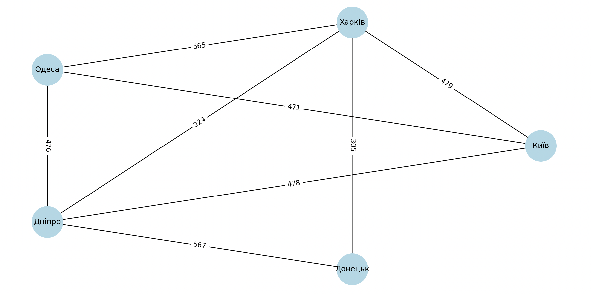
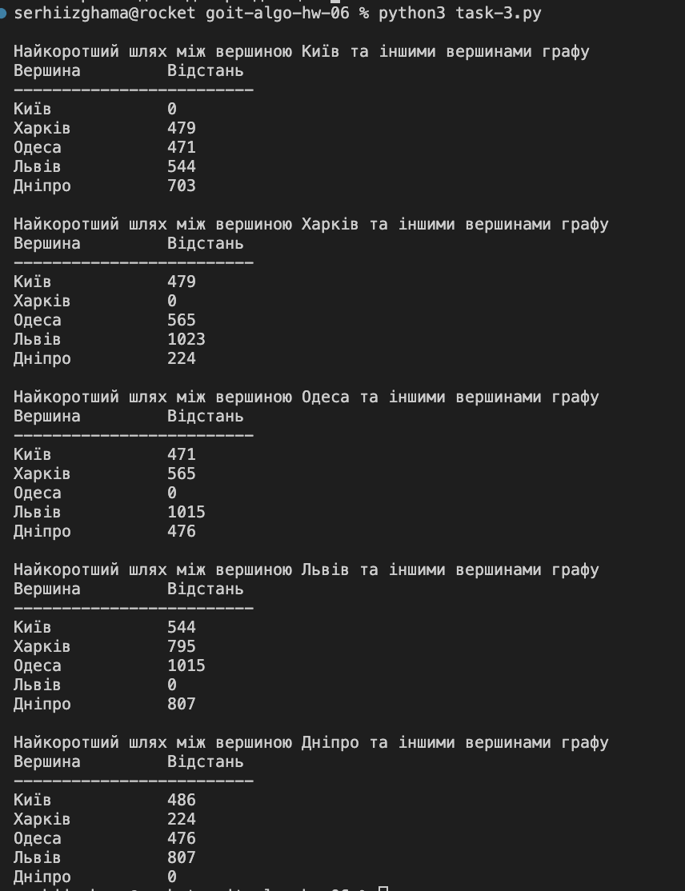

# goit-algo-hw-06
goit-algo-hw-06

## Завдання 1
Створіть граф за допомогою бібліотеки networkX для моделювання певної реальної мережі (наприклад, транспортної мережі міста, соціальної мережі, інтернет-топології).

## Завдання 2
Напишіть програму, яка використовує алгоритми DFS і BFS для знаходження шляхів у графі, який було розроблено у першому завданні.

### Результати виконання обох алгоритмів для мого графа:

Breadth-first search (BFS):
Київ Харків Одеса Дніпро Донецьк 

Depth-first search (DFS):
Київ Харків Одеса Дніпро Донецьк

### Aлгоритм BFS (Breadth-first search):
За результатами виконання алгоритму BFS ми бачимо, що він працює очікувано та коректно. Тобто спочатку алгоритм бере вершини які з'єднані з нашою "початковою" вершиною (Київ) ребрами - "найближчі" вершини, а потім алгоритм переходить до вершин пов'язаних ребрами вже з "найближчими" вершинами, і так далі поки не пройде всі вершини.

### Aлгоритм DFS (Depth-first search):
За результатами виконання алгоритму DFS ми бачимо, що він працює очікувано та коректно. Тобто спочатку алгоритм йде по вершинам до самої глибини, поки є зв'язок ребрами між вершинами, коли таких вершин більше нема, алгоритм починає з початку шукати які вершини він ще не пройшов.

## Завдання 3
Реалізуйте алгоритм Дейкстри для знаходження найкоротшого шляху в розробленому графі: додайте у граф ваги до ребер та знайдіть найкоротший шлях між всіма вершинами графа.

